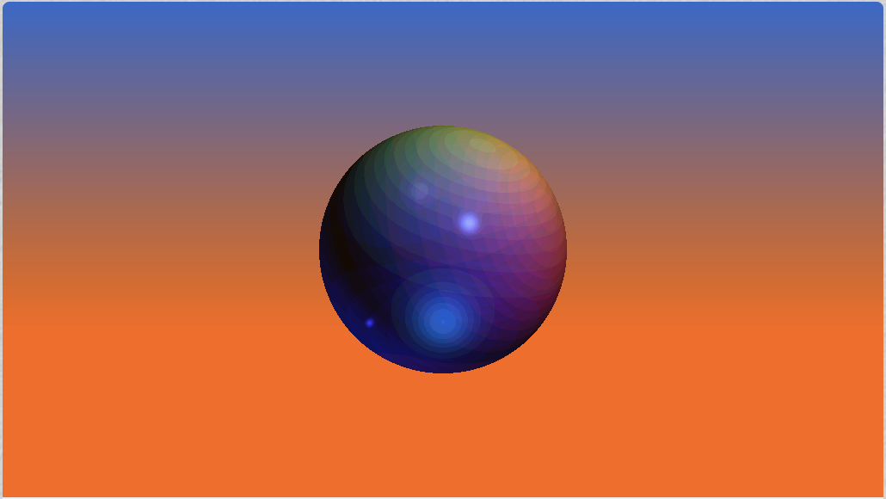

## Ian Melvin
I'm Ian Melvin, I make games and other miscellaneous programming projects. I have worked in Unity, Android Studios, and Shadertoy amongst other programs. Much of my experience programming is with C++ and C#, but I'm familiar with many other languages such as JavaScript, OpenGL, and Kotlin. My biggest passion with programming is UI programming for video games.

## Projects

### Game Engine (Class Project)



Description: A game engine developed in Visual Studios using C++. Currently the engine is set up with functionality to place/delete a sprite, freeze/unfreeze the sprite's animation, and exit the program. This is set up to be a demo and show that the engine works. This is the set up for a team based project to develop a game in my engine. The video highlights main.cpp, the Game Class, and two of the Input classes.

From September 2021 - Present

### Dead Pedal Drifting (Class Project)



[Link to project](https://larnio.itch.io/dead-pedal-drifting)

Description: Single Player game made in Unity. The player does quests in the wasteland, destroying enemy cars and collecting scrap metal. Every quest gives a cash reward. Between quests the player can customize their vehicles color, buy new weapons, and buy stats upgrades for the vehicle and weapons.

Team size: 7

From March 2021 - May 2021

Role: UI programmer

What I did: Using UI designs from one of the team's designers, I implemented and programmed the UI, camera movement, and systems for the Garage/Hub

### Raccoon-Dad's Feasts Far Away(Class Project)



Description: Single Player game made in Unity. The basis of the project was to make a game which highlighted a culture or group of people you are not a part of, for this game we decided to focus on food in the Philippines. As the player, you go to different locations and collect ingredients to make a dish. Raccoon-Dad serves as the guide for the player.

Team size: 5

From 2/21/2021 - 3/23/2021 (4 weeks)

Role: Programmer

What I did: I did most of the programming, including(but not limited to) the title screen, country select, minigame, textboxes and text reading.

### Murmur's of the Past(Class Project)



Description: Single Player game made in Unity. The basis of the project was to make a game based on 3 verbs. The verbs for this project were murmur, scatter, invert. As the player you can switch between two characters, the elf and the demon. The elf can move boxes, the demon can shoot projectiles at enemies. The goal of the game is to collect runes and return to the portal in the starting room to escape. The runes are randomly placed in different rooms each time the game is played. 

Team size: 4

From 1/29/2021 - 2/15/2021 (3 weeks)

Role: Programmer

What I did: I did all of the programming for the title and end screen, the enemies, the player character(s) and the abilities, the camera movement between rooms, and the win state.

### Vietsnam Bot (Personal Project)



Description: JavaScript based Discord Bot with functionality to delete a user inputed number of posts, post images and text when certain phrases are typed, allow users to save their own text/image/gif responses and text based triggers, and being a general testing ground for different ideas.

From August 2020 - Present

### OpenGL Shader project (Class Project)

[Link to project](https://www.shadertoy.com/view/wsdcW4)

Description: An OpenGl based project, made in shadertoy. This project displays Lambertian reflection, Blinn-Phong reflectance and cel shading.

Made in October 2020
